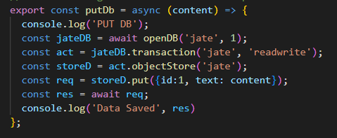

# text-Editor

## Description

This application uses IndexedDB to save information written in the text editor to enable use online and offline also, has the option to be installed.

[Link to Live Webpage](https://justate.herokuapp.com/)

---

Here's a few quick links:

* [Installation and Usage](#Installation-and-Usage)
* [Code Snippets](#code-snippets)
* [Technology used](#technology-used)
* [License](#license)
* [Author](#author)
---

## Installation and Usage

1. Navigate to the [GitHub Repository](https://github.com/fiaschettima/text-Editor) 
2. Clone the Repository to your computer
3. In terminal navigate to the cloned Repository
`
cd text-Editor
`
4. After navigatiing to the file in terminal enter the command:
`
npm run start
`
5. The text editor will now be live on Local Host 3001
 
---

## Code Snippets

This snippet of code shows the steps needed to be taken to store data to indexedDb.

---

## Technology Used
    
    JS
    IndexedDB
    Webpack

---

## License

    MIT License
---
## Author
    
    Matthew Fiaschetti 
[Github Profile](https://github.com/fiaschettima)
